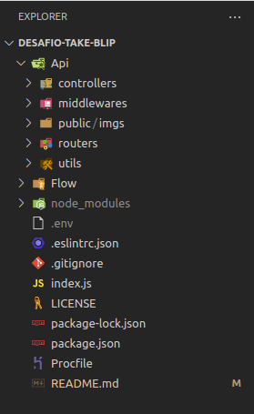
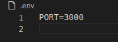
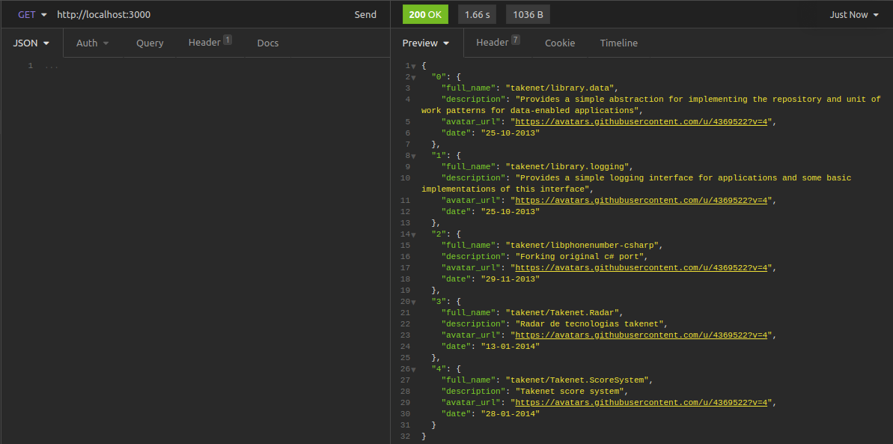
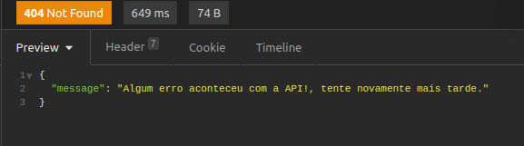

## Olá seja bem-vindo(a) API Rest do desafio prático da [Take Blip](https://digital.take.net/conversas-inteligentes/?utm_source=Google&utm_medium=cpc&utm_term=take%20blip&utm_campaign=SEMB_Take-Blip-geral%20%28b-p-e%29&hsa_acc=2783574544&hsa_kw=take%20blip&hsa_ve=3&hsa_ad=511086110762&hsa_net=adwords&hsa_mt=e&hsa_cam=12320816312&hsa_src=g&hsa_tgt=aud-1180190166859:kwd-809239209550&hsa_grp=117951638579&utm_id=go_cmp-12320816312_adg-117951638579_ad-511086110762_aud-1180190166859:kwd-809239209550_dev-c_ext-_prd-_mca-_sig-CjwKCAjwjdOIBhA_EiwAHz8xm2U8kiDYD_yfPk0TQOn6w0tNpnvY_F1ycQOeXjHhZR8TlRSttX_gxxoCTDYQAvD_BwE&gclid=CjwKCAjwjdOIBhA_EiwAHz8xm2U8kiDYD_yfPk0TQOn6w0tNpnvY_F1ycQOeXjHhZR8TlRSttX_gxxoCTDYQAvD_BwE) :rocket:

Antes de qualquer coisa, este projeto está hospedado [AQUI](https://take-languages.herokuapp.com/),
o endpoint retorna os 5 respositórios mais aintigos da [Take Blip](https://digital.take.net/conversas-inteligentes/?utm_source=Google&utm_medium=cpc&utm_term=take%20blip&utm_campaign=SEMB_Take-Blip-geral%20%28b-p-e%29&hsa_acc=2783574544&hsa_kw=take%20blip&hsa_ve=3&hsa_ad=511086110762&hsa_net=adwords&hsa_mt=e&hsa_cam=12320816312&hsa_src=g&hsa_tgt=aud-1180190166859:kwd-809239209550&hsa_grp=117951638579&utm_id=go_cmp-12320816312_adg-117951638579_ad-511086110762_aud-1180190166859:kwd-809239209550_dev-c_ext-_prd-_mca-_sig-CjwKCAjwjdOIBhA_EiwAHz8xm2U8kiDYD_yfPk0TQOn6w0tNpnvY_F1ycQOeXjHhZR8TlRSttX_gxxoCTDYQAvD_BwE&gclid=CjwKCAjwjdOIBhA_EiwAHz8xm2U8kiDYD_yfPk0TQOn6w0tNpnvY_F1ycQOeXjHhZR8TlRSttX_gxxoCTDYQAvD_BwE)

Este projeto consiste em uma API no padrão rest que faz uma requisição para API do github listando 
os repositórios de um usuário ou organização filtrando por linguagens.
O desfio proposto faz parte do desafio técnico da take-blip. Vem comigo que este projeto ficou da hora :alarm_clock:

### Esta API é consumida em um BOT na plataforma da Take Blip, todo um Fluxo foi criado para utilização destes dados na API.
### O fluxo do BOT está em um arquivo .JSON na pasta Flow.

## Estrutura

Procurei implementar uma arquitetura na API, mesmo sabendo que só possui uma rota, somente um endpoint.
Sempre pensando em escalabilidade e organização.
A aquitetura pensada foi a **`MSC`**, mas sem a camada de `Services` pois a mesma é normalmente utilizada 
para regras de negócio e camada com banco de dados.

**`MSC`** - MODEL, SERVICES e CONTROLLERS

- #### API

1. Pasta Controllers se dedica apenas para receber requisições e aplicar a logica necessaria
   para o resultado esperado.

2. Pasta de middlewares ficam os middlewares, neste projeto possui um middleware de erro.

3. Pasta routers contém as rotas da aplicação.

4. Pasta public contém as imagens utilizadas no projeto.

5. Pasta ultils contém pequenas funções, neste projeto possui a requisição para API do github.

- #### Flow

1. Pasta Flow possui todo fluxo do bot desenvolvido na plataforma da [Take Blip](https://digital.take.net/conversas-inteligentes/?utm_source=Google&utm_medium=cpc&utm_term=take%20blip&utm_campaign=SEMB_Take-Blip-geral%20%28b-p-e%29&hsa_acc=2783574544&hsa_kw=take%20blip&hsa_ve=3&hsa_ad=511086110762&hsa_net=adwords&hsa_mt=e&hsa_cam=12320816312&hsa_src=g&hsa_tgt=aud-1180190166859:kwd-809239209550&hsa_grp=117951638579&utm_id=go_cmp-12320816312_adg-117951638579_ad-511086110762_aud-1180190166859:kwd-809239209550_dev-c_ext-_prd-_mca-_sig-CjwKCAjwjdOIBhA_EiwAHz8xm2U8kiDYD_yfPk0TQOn6w0tNpnvY_F1ycQOeXjHhZR8TlRSttX_gxxoCTDYQAvD_BwE&gclid=CjwKCAjwjdOIBhA_EiwAHz8xm2U8kiDYD_yfPk0TQOn6w0tNpnvY_F1ycQOeXjHhZR8TlRSttX_gxxoCTDYQAvD_BwE)

## Tecnologias utilizadas

- Linguagens:
    - NodeJs
- Configurações / variáveis de ambiente
    - Dotenv
- Organização e Padronização de codigo:
    - Eslint / config-airbnb-base
- Facilitador de desenvolvimento:
    - nodemon
- framework's:
    - Express
- Status code das requisições:
    - @hapi/boom
- Manipulação de erros:
    - express-rescue
- Conversão de data / hora
    - moment
- Requisição API:
    - node-fetch

## Começando

#### Para executar o projeto, será necessário ter instalado:

1. [Insomnia](https://insomnia.rest/download) para fazer requisições nas rotas da API. (ou qualquer outro para testes de API)
2. [NodeJS](https://nodejs.org/en/) Este projeto necessita do NodeJs instalado em seu computador para rodar localmente.

#### Próximos passos

- Clone o repositório `  git clone git@github.com:clebertonf/Desafio-Take-Blip.git`
- Na raiz do projeto rode o comando **npm install** para instalar as depedências do projeto.

## Configuracão

Crie um arquivo com nome **`.env`** na raiz do projeto, dentro deste arquivo adicione a seguinte 
variável de ambiente:

1. **`PORT=3000`**  *Aqui insira a porta que API irá funcionar (Padrão 3000)*

------

## Executando API

Verifique o `package.json`, lá se encontram scripts para execução do projeto.

- `"dev": "nodemon index.js",`  (`npm run debug`) inicia o projeto com nodemon.
- `"start": "node index.js",` (`npm start`) inicia o projeto com  node.

## Endpoint da API (lista repositórios na ordem crescente, pela linguagem C#)

1. ####  `GET` localhost:3000/

   Este endpoint lista os 5 primeiros repositórios mais antigos da take blip na linguagem c#.

   

- Validação de erros:
  
   Caso Endpoint não exista, o seguinte erro e retornado:

   

### Vou ficando por aqui, caso queira me contactar será um prazer! até breve!